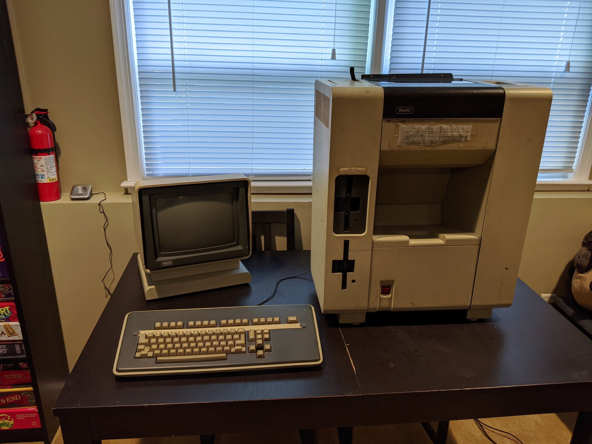
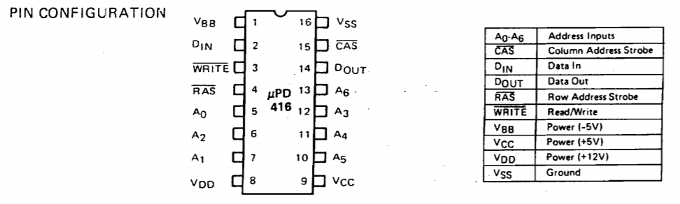
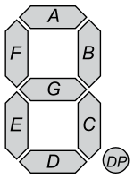

# Wang Writer 5503 Restoration Project



This is my adventure in trying to restore a word processor from 1981 to working condition. At this time, it is not currently working. It powers on, but it does not pass its power-on tests and does not currently get far enough to even attempt to load its system software from the floppy disks.

## Acquisition and a Mission
In early September 2020 I stumbled across a Facebook Marketplace post titled: "[Old computer setup processor monitor wang 40 dollars estate find](images/fb_marketplace.png)". I love old hardware, and already own a few other vintage systems, so I wasn't going to pass this one up. I've heard of the [Wang](https://en.wikipedia.org/wiki/Wang_Laboratories) company in the past, but I've never actually gotten my hands on one. (The "wang" jokes just write  themselves, don't they?)

I messaged the guy on Facebook Marketplace, and later that night I met him at his storage unit to pick it up. It was in serious need of a cleaning and smelled like it spent the last 30 years in a basement. But it came with _everything_. Cables, system disks, user and technical service manuals, etc.

What I couldn't find was any information about this on the internet. Searching Google for "Wang Writer 5503" returned nothing. (That search now returns my own Reddit and VCF posts)

Given the lack of information about this machine I'll be doing my best to document as much as I can about it as I can and hopefully get it working in the process. I'll be periodically updating the work log below as best I can. If I fall out of touch with this repo feel free to reach out to me on Twitter, Reddit, or where ever else you can find me.

## Contact Me, Please!
I can't seem to find any information about this machine on the internet beyond a single line-item in a PDF of a parts catalog.

If you've used this model of word processor, know anything about it, or have any suggestions on how I can better diagnose what may be wrong with it, I'd love to hear from you.

You can reach out to me via any of the accounts used in the posts under the _Links_ section below or via Twitter.

# Links
* [Photo Album (Google Photos)](https://photos.app.goo.gl/h5TvAR3F5gg16o3e6)
* [My post on /r/retrocomputing](https://www.reddit.com/r/retrocomputing/comments/imo90m/wang_writer_5503_is_anyone_familiar_with_this/)
* [My post on Vintage Computer Federation forums](http://www.vcfed.org/forum/showthread.php?76671-Wang-Writer-5503-In-search-of-information-details-history-etc)
* [@Ricapar on Twitter](https://twitter.com/Ricapar)

# Work Log

## 2020-09-20
I'm going to table the rest of the boot ROM until the new EPROM/EEPROM chips arrive. I'm also restocking on breadboard jumper wires. Those have a knack for disappearing.

The plan for the day was to use a spare Arduino Uno R3 to test some of the DRAM on the memory PCA. I had come across a number of posts across various vintage computing forums. A handful of links are available on the _Memory Testing Ideas_ section at the bottom of this page.



The uPD416C-2 chip is a 16Kx1 RAM chip. This means that the chip provides 16,384 possible addresses, and at each address you can store a single bit. Using the chip is a bit more complicated though. Looking at the pinout above, it only has 7 address lines (A0-A6). With 7 address lines you can you can only represent 7 bits at a time, which would limit you to only 128 addresses. To get 16K addresses the chip multiplexes those 7 address lines via timed latches on the RAS (Row Address Strobe) and CAS (Column Address Strobe) lines. This takes the the 128 possible addresses and multiplies it by another 128 possible addresses, giving us a total of 16,384.

Putting aside the timing, the process to read an address would be:

1. Set RAS, CAS, and WRITE to HIGH.
1. Set the row address.
1. Set RAS to LOW.
1. Set the column address.
1. Set CAS to LOW.
1. Read the state of the DATA_OUT line.

Easy enough, and most DRAM chips seem to work this way. This chip in particular has three voltage-in lines: +5v, +12v, and -5v.

I have the breadboard all wired in and ready with the Arduino, but only after I had everything wired up and ready to go did I realize that I needed to supply the chip _with all three_ expected voltages. Unfortunately I can't do that directly off of the Arduino's power, so I'm going to need to power the chip and the Arduino off of a different power supply.

Unfortunately by the time I realized this I was done tinkering for the day. I don't have inverter chips laying around, nor do I have a power supply laying around that outputs all +5v, +12v, and -5v at the same time. Once my extra jumper cables come in the plan will be to piggy-back off of the Wang's power supply, which does output all of those voltages (plus a few others) and power the Arduino off of that and see how the RAM testing goes.

More to come!

## 2020-09-19 (Part 2)
I spent most of the afternoon reading through the manual again. Less looking at schematics, more reading details. Found the output address table! At the very end of the table is how the 7-segment error display at the end is controlled:

```
ADDRESS       DATA

5F       Error Display (7 Segment)
              0 A (L)
              1 F (L)
              2 E (L)
              3 D (L)
              4 C (L)
              5 G (L)
              6 B (L)
              7 DP (L)
```

The `(L)` indicates that when those bits are set LOW, the display should have those segments lit up.

Thankfully 7-segment displays seem to have pretty standard naming and ordering.



On boot-up I was getting a "7" on the display. That's segments A, B, and C. By the table in the manual, that means that bit positions 0, 4, and 6 should be LOW (0).


```
                              Binary     Hex
Data:                1 0 1 0 1 1 1 0      AE
7-Segment Position: DP B G C D E F A
```

A quick CTRL+F in the boot ROM found several sections like this:

```
XC4B3:
	LD	A,$AE
	OUT	($5F),A
```

Load hex `AE` into the A register, followed by outputting the A register into `5F`, the address that controls the 7-segment display. This instruction causes the 7-segment display to display what we would read as the number 7. This pattern is used throughout the ROM. Every write to `5F` always comes from the A register.

My idea is that if I can follow through its execution and find the area of code that is identifying the fault, I can trace what it is actually testing and hopefully identify where the fault actually exists.

Unfortunately, at some point during today's debugging and probing the display changed from displaying a 7 to displaying a 6.

Same approach - figure out what segments would represent the number "6" and flip the right bits:

```
                              Binary     Hex
Data:                1 1 0 0 0 0 0 0      C0
7-Segment Position: DP B G C D E F A
```

A CTRL+F through the ROM finds four areas where a value of `C0` is written to the A register. That's too bad, because there was only one area where the previous value of `AE` was coming from.

I'll be spending some more time digging through the ROM's code, seeing if I can trace where what section of code is triggering the write of `C0` to the 7-segment display.

In the meantime I also ordered some replacement 2716 EPROM chips. I don't want to risk breaking or wiping original one, but I'm thinking I may flash a replacement one with a modified copy of the boot ROM code and see what I can make it do. Maybe see if I can skip some checks for non-critical components or just make it do something else that's interesting.

It'll probably get annoying to have to UV-wipe the EPROMs with any code changes I want to do, so I also ordered some EEPROMs. The pinouts are close, but not the same. I'll probably run it off of a breadboard with the adjusted pinout to get started - it should allow me to iterate quickly on any code changes. If I get something I intend to keep for a while maybe I'll take the time to burn it onto the EPROM. Or maybe I can make an adapter socket if I'm feeling adventurous :)


## 2020-09-19
I've been spending some time the past few days going through the service manual. I've got my bearings now, and can generally find where a component is located within the schematics without too much trouble.


### Power Supply Tests
I didn't note this in an earlier update, but I did go through all of the power supply outputs and confirmed they are all up to spec. The service manual contained a nicely detailed table containing the expected voltages and tolerances for each pin going into the motherboard, and everything was up to spec.

```
+5V (4.75 -to- 5.25Vdc)          J1 Printer PCA pin 1, ground pin 3
+12V (11.40 -to- 12.60Vdc)       J1 Printer PCA pin 5, ground pin 3
-5V (-4.75 -to- -5.10Vdc)        J1 Printer PCA pin 7, ground pin 3
-12V (-11.76 -to- -12.24Vdc)     J1 Printer PCA pin 9, ground pin 3
+18V (+14.00 -to- 21.00Vdc)      J3 Printer PCA pin 1, ground pin 3
+36V (+28.00 -to- 42.00Vdc)      J3 Printer PCA pin 5, ground pin 3
```

### Chips' (testing) Challenge
The system boot-up says that the error message is coming from CPU board, so most of my testing has been focused on there. Every removable chip has been removed and re-seated. Contacts have been cleaned as well. No changes there.

I'm slowly going through all of the chips on the CPU board, verifying at the very least that they're getting the expected voltage on the their +5V pins.

## 2020-09-15
Dumped the boot PROM from the middle motherboard. PROM chip is a Hitachi HN462716G; was able to get it dumped using XGPro with a TL866Plus EPROM reader/writer. 

The PROM dump contained some strings that seem to indicate that there may have been errors in reading the ROM. It's a 2K ROM chip, but according to the manual the ROM is wired into the bus at memory addresses 0xC000 through 0xC400, indicating that it may only be actually mapping the first 1K of data out of the chip. The error is presented a bit past the 1K mark, so I'm not entirely sure if I'm already dead in the water with a PROM that's lost some bits over the last 40 years.

```
00000720  5d 80 f1 e6 0f c6 90 27  ce 40 27 77 23 c9 4d 65  |]......'.@'w#.Me|
00000730  6d 6f 72 79 20 45 72 72  6f 72 20 61 74 20 20 20  |mory Error at   |
00000740  20 20 20 70 61 67 65 0d  45 78 70 65 63 74 65 64  |   page.Expected|
00000750  20 64 61 74 61 20 3d 0d  52 65 63 65 69 76 65 64  | data =.Received|
00000760  20 64 61 74 61 20 3d 0d  58 4f 52 20 64 61 74 61  | data =.XOR data|
```

Nevertheless, I was able to disassemble the ROM using [Mdz80](https://www.z80cpu.eu/78-data-articles/projects/76-mzt), a disassembler for the Z80 CPU.

```
mdz80 -a -f -v -xc000 rom_l59.bin
```
The `-xc000` flag was key and took me a few minutes to realize why I couldn't follow through the assembly that came out of the first dump I did. The Z80 CPU starts its program counter at memory address 0 but the ROM is wired into memory address 0xC000, so any addresses referenced within the disassembled code need to have 0xC000 added.

The binary and disassembled ROM can be found here:

* Binary: [roms/rom_l59.bin](roms/rom_l59.bin)
* Hexdump: [roms/rom_l59.hex](roms/rom_l59.hex)
* Disassembled: [roms/rom_l59.z80](roms/rom_l59.z80)

## 2020-09
Acquired! Cleaned and it's now taking over a table and half the floor in my TV/game room.

It powers on. No smoke or sparks. Doesn't boot up though.

According to the manual the 7-segment display on the back is used to indicate where the power-up diagnostic routine has identified faults.

The display reads a "7", indicating:

| Error Code | PCA      | FRU                                            |
|------------|----------|------------------------------------------------|
| 7          | CPU 7777 | CPU UART OR PIO, KEYBOARD CABLE, KEYBOARD UART |


# References

Datasheets and stuff. These are here mostly for my own reference.

## Datasheets
* [Z80A CPU](https://www.zilog.com/manage_directlink.php?filepath=docs/z80/um0080&extn=.pdf)
* [HN462716G EPROM](https://pdf1.alldatasheet.com/datasheet-pdf/view/116083/HITACHI/HN462716G.html)
* [uPD416C-2 16K x 1-Bit RAM](https://www.datasheets360.com/pdf/1852544526355807954)
* [Intel P8272 Floppy Disk Controller](https://datasheetspdf.com/pdf-file/627488/IntelCorporation/8272/1)
* [D3-6402-9 UART](https://datasheetspdf.com/datasheet/D3-6402R-9Z.html) (Not an exact match, but seems to be a compatible chip. Why was this one so hard to find a datasheet for?)

## Z80 Stuff
* [Z80 Assembly](http://tutorials.eeems.ca/Z80ASM/app1.htm)

## Memory Testing Ideas
* [Testing DRAM, one byte at a time](https://hackaday.com/2016/03/18/testing-dram-one-byte-at-a-time/)
* [Arduino DRAM Tester](https://github.com/FozzTexx/DRAM-Tester/blob/master/Arduino-DRAM-tester.ino)
* [DRAMARDUINO - Dram tester with Arduino](https://forum.defence-force.org/viewtopic.php?t=1699)
